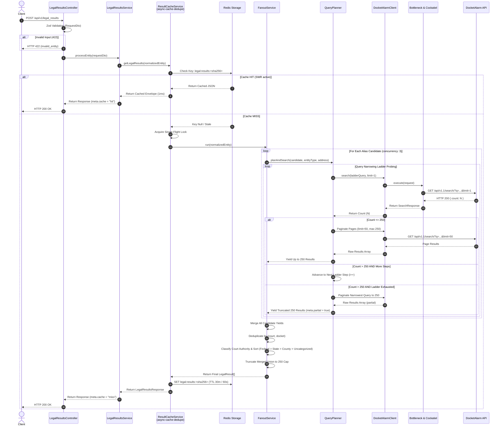
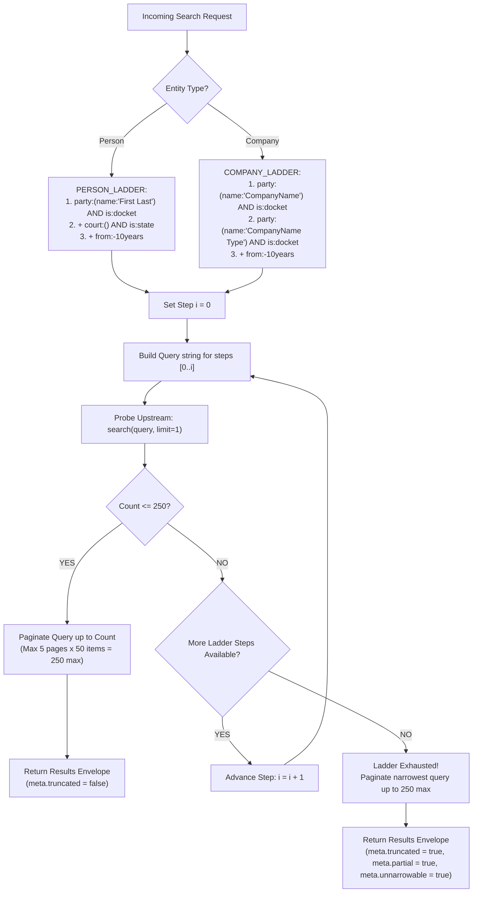

# Intelligo × DocketAlarm — Production Legal Results Microservice

High-concurrency, stampede-resistant NestJS microservice integrating the [DocketAlarm](https://www.docketalarm.com/api/v1.1/) US legal search API. Exposes `POST /api/v1/legal_results` to receive an entity (Person or Company) and return matching legal cases where the subject appears as a **party**, sorted newest-first with court-authority pre-sorting.

---

## 🏛️ Key Architectural Features

- **Query Planner & Narrowing Ladder**: Enforces the 250-result product cap via an upstream probing ladder (`party:(name:...) AND is:docket` -> `+court:(...) AND is:state` -> `+from:-10years`) rather than client-side truncation.
- **Stampede & Cache Coalescing**: Uses `async-cache-dedupe` with Redis storage to provide in-process Promise single-flight and cross-pod cache coalescing with Stale-While-Revalidate (SWR).
- **Outbound HTTP Resilience**: Powered by a shared `undici` `Agent` pool (keep-alive, max 100 connections) wrapped in a `cockatiel` policy stack (`bulkhead`, `circuitBreaker`, `retry`, `timeout`).
- **Cluster-Wide Rate Limiting**: `bottleneck` using `ioredis` datastore with dynamic AIMD (Additive Increase / Multiplicative Decrease) adaptation responding to HTTP 429 and `Retry-After` headers.
- **Shared Token Election**: 90-minute DocketAlarm tokens cached in Redis using `SET NX PX` election lock and `da:token:new` PubSub notification for seamless token rotation.
- **Court Classifier & Authority Sorting**: Deterministic court tier classification (`FEDERAL > STATE > COUNTY > UNCATEGORIZED`) with specialty court override rules (`'United States Tax Court'`).
- **State Abbreviation Bypass**: Sidesteps DocketAlarm's expansion traps (e.g. `NY`, `IN`, `OR`) using explicit full court name mappings.
- **Full Observability Triad**: Structured Pino logging + `nestjs-cls` AsyncLocalStorage correlation IDs (`X-Request-Id`), Prometheus metrics endpoint (`GET /metrics`) with 8 custom series (upstream latency & status, cache hit/miss, circuit state, dedup wins, token refresh election outcomes, narrowing steps, alias fan-out size), and OpenTelemetry SDK with auto-instrumentation for `undici`/`ioredis`/`pino`/`http` (activates when `OTEL_EXPORTER_OTLP_ENDPOINT` is set — otherwise a no-op).
- **Per-Request Upstream Budget**: Hard 30-call ceiling per incoming request, cooperatively spent across every alias/step/page. Prevents one pathological input from monopolizing the shared rate-limiter reservoir; short-circuits with `partial: true, unnarrowable: true` when hit.
- **Horizontal Scale, No Node Clusters**: Every shared piece of state (result cache, single-flight lock, DA token, Bottleneck reservoir, circuit signal via retryable outcomes) lives in Redis. Scale is one Node process per container × N containers via the orchestrator (`--scale app=N`), never Node's `cluster` module — see the plan file for the reasoning.
- **Zero-Downtime Graceful Shutdown**: Intercepts SIGTERM/SIGINT signals to flip readiness (`/health/ready` -> 503), wait 5s for load balancer propagation, stop accepting connections, drain in-flight requests up to 25s, and cleanly close Redis/Bottleneck/undici Agent/OTel SDK.

---

## 📐 System Architecture & Request Execution Flow

### 1. High-Level Sequence Diagram



### 2. Query Planner Narrowing Ladder & Probing Flow



---

## 🛠️ Tech Stack

| Domain | Technology |
|---|---|
| **Runtime & Framework** | Node.js 20 LTS, NestJS 11, TypeScript (`strict: true`) |
| **Outbound HTTP** | `undici` (Shared `Agent` with keep-alive) |
| **Resilience & Fault Tolerance** | `cockatiel` |
| **Rate Limiting** | `bottleneck` (`datastore: 'ioredis'`) |
| **Caching & Single-Flight** | `async-cache-dedupe` (Redis storage) |
| **Redis Client** | `ioredis` 5.x |
| **Config & DTO Validation** | `@nestjs/config`, `zod`, `nestjs-zod` |
| **Logging & Correlation** | `nestjs-pino`, `nestjs-cls` |
| **Metrics & Observability** | `prom-client`, `@opentelemetry/sdk-node` |
| **Health Checks** | `@nestjs/terminus` |
| **Test HTTP Mocking** | `undici.MockAgent` |
| **Containerization** | Docker, Docker Compose (2 app replicas + Redis 7) |

---

## 🚀 Quick Start (Docker Compose)

### 1. Environment Setup
Copy `.env.example` to `.env` and fill in your DocketAlarm credentials:

```bash
cp .env.example .env
```

Edit `.env`:
```env
DA_USERNAME="your_docketalarm_username"
DA_PASSWORD="your_docketalarm_password"
```

### 2. Launch the Application Stack

Docker Compose respects `deploy.replicas` only when combined with `--scale`; plain `docker compose up` launches a single instance. To run 2 replicas (the design's stampede-and-token-election test target), use:

```bash
docker compose up --build --scale app=2 -d
```

`docker-compose.override.yml` maps replica 1 to host port **3001** and replica 2 to host port **3002** (Redis is exposed on host **6380** to avoid clashing with a local Redis on 6379).

For a single-instance quick run:

```bash
docker compose up --build -d
```

### 3. Verify Health Endpoints
```bash
# Liveness (process alive, event loop responsive)
curl -sf http://localhost:3001/health/live
curl -sf http://localhost:3002/health/live

# Readiness (Redis reachable — flips to 503 during SIGTERM drain)
curl -sf http://localhost:3001/health/ready
curl -sf http://localhost:3002/health/ready
```

---

## 📖 API Reference

### 1. Search Endpoint (`POST /api/v1/legal_results`)

#### Request Payload Example (Person with Address)
```json
POST /api/v1/legal_results
Content-Type: application/json

{
  "entityId": 43432,
  "entityType": "Person",
  "sender": "INTELLIGO",
  "entityDetails": {
    "name": [
      { "full": "Bradley Friedman", "confidence": 0.9 },
      { "full": "Brad Friedman", "confidence": 0.6 }
    ],
    "address": [
      { "full": "123 Ocean Drive, Miami, FL 33139", "confidence": 0.95 }
    ]
  }
}
```

#### Request Payload Example (Company)
```json
POST /api/v1/legal_results
Content-Type: application/json

{
  "entityId": 55,
  "entityType": "Company",
  "entityDetails": {
    "name": [
      { "full": "Westlake Services", "confidence": 1.0, "type": "LLC" }
    ]
  }
}
```

#### Success Response Envelope (HTTP 200)
`dateFiled` is passed through in DocketAlarm's native `mm/dd/yyyy` format (or `null` when missing/unparseable — those results sort last).

```json
{
  "results": [
    {
      "court": "Florida Middle District Court",
      "docket": "8:23-cv-01234",
      "title": "Friedman v. Acme Corp",
      "link": "https://www.docketalarm.com/cases/...",
      "dateFiled": "01/15/2024",
      "courtTier": "FEDERAL"
    }
  ],
  "meta": {
    "entityId": 43432,
    "entityType": "Person",
    "count": 1,
    "upstream_count": 1,
    "truncated": false,
    "partial": false,
    "unnarrowable": false,
    "cache": "miss",
    "requestId": "req-8f92a10b",
    "elapsedMs": 142
  }
}
```

#### Unnarrowable Response (HTTP 200 with `partial: true`)
When the entity is so broad the ladder cannot get under 250 (e.g. `GOLDMAN SACHS` — 162k+ upstream matches), the service returns the narrowest set (≤ 250 rows after dedup) and flags the outcome. Product decides UX; never a hard failure.

```json
{
  "meta": {
    "entityId": 88,
    "entityType": "Company",
    "count": 233,
    "upstream_count": 162754,
    "truncated": true,
    "partial": true,
    "unnarrowable": true,
    "cache": "miss",
    "requestId": "req-…",
    "elapsedMs": 7931
  }
}
```

#### Rejection Responses
Two distinct error paths:

- **HTTP 400 `bad_request`** — DTO shape violates the zod schema (missing `entityType`, non-numeric `entityId`, malformed `entityDetails`, etc.). Caught at the pipe layer.
- **HTTP 422 `invalid_entity`** — DTO valid but the domain rules reject it: empty `name[]`, all candidates below `ALIAS_CONFIDENCE_THRESHOLD` (default `0.5`), Person top-confidence name has no last name, Company top-confidence name is empty after trim.

```json
{
  "error": {
    "code": "invalid_entity",
    "message": "No name candidate meets the minimum confidence threshold",
    "requestId": "req-12345"
  }
}
```

---

### 2. Prometheus Metrics (`GET /metrics`)
Exposes custom application and process metrics for scraping:

```bash
curl -s http://localhost:3001/metrics | grep -E '(upstream_|cache_|circuit_|token_|dedup_|narrowing_|alias_fanout_)'
```

Custom metrics:

| Metric | Type | Labels | Fires from |
|---|---|---|---|
| `upstream_duration_seconds` | histogram | `endpoint`, `status` | DocketAlarm client, per request |
| `upstream_status_total` | counter | `endpoint`, `status` | DocketAlarm client, per request |
| `cache_hits_total` | counter | `result` (`hit`/`miss`/`stale`/`bypass`) | ResultCacheService |
| `circuit_state` | gauge | `name` (`docket_alarm`) | cockatiel `onBreak`/`onReset`/`onHalfOpen` (`0`=closed, `1`=half, `2`=open) |
| `dedup_wins_total` | counter | `scope` (`in_process`) | `async-cache-dedupe` `onDedupe` |
| `token_refresh_total` | counter | `result` (`won_lock`/`waited`/`failed`) | TokenService election |
| `narrowing_steps_bucket` | counter | `ladder_step` (`party`/`state`/`name`/`type`/`10years`) | QueryPlanner per probe |
| `alias_fanout_size` | histogram | (none — buckets 1/2/3/5/10) | FanoutService per request |

### 3. Environment Variables

See [`.env.example`](.env.example) for the full annotated list. Highlights:

| Var | Purpose | Default |
|---|---|---|
| `DA_USERNAME` / `DA_PASSWORD` | DocketAlarm credentials (never logged; masked in pino redact list) | — |
| `DA_TEST_MODE` | When `true`, appends `test=1` to every DA call so no requests are billed. Auto-true when `NODE_ENV=test`. | `false` |
| `REDIS_URL` | Shared state (validated as `redis://` or `rediss://`) | `redis://localhost:6379` |
| `CACHE_TTL_SECONDS` / `CACHE_STALE_SECONDS` | SWR window; stale must be `<=` ttl (zod-enforced) | `1800` / `300` |
| `ALIAS_CONFIDENCE_THRESHOLD` | Candidates below this are dropped from single-name and fan-out paths | `0.5` |
| `OTEL_EXPORTER_OTLP_ENDPOINT` | OTel OTLP-HTTP collector URL. Leave unset to disable OTel entirely. | — |
| `LOG_LEVEL` | pino level | `info` |

---

## 🧪 Testing & Verification

### Run Unit & Integration Tests
Executes 15 test suites and 72 tests covering query planning, court classification, token elections, Bottleneck AIMD rate limiting, and Cockatiel circuit breakers:

```bash
npm test
```

### Run E2E Golden Entity Fixtures Test
Runs full end-to-end integration tests using `undici.MockAgent` against the 5 golden entity fixtures (`bradley-friedman`, `gilbert`, `westlake`, `goldman-sachs`, `christopher-brien`):

```bash
npm run test:e2e
```

### Run Stampede Coalescing Verification
Assures that 50 concurrent identical requests coalesce to **EXACTLY 1 upstream search call**:

```bash
npx jest test/integration/stampede.integration-spec.ts
```

### Run Empirical Probe Suite (Against Real DocketAlarm Credentials)
Runs live account probes to inspect token concurrency, rate-limit headers, and upstream error strings:

```bash
npm run probes
```

---

## 📂 Repository Structure

```
src/
├── main.ts                          # Bootstrap: enableShutdownHooks, helmet, ValidationPipe, SIGTERM drain
├── app.module.ts                    # Root module composition
├── config/                          # Zod environment schema validation & APP_CONFIG token
│   ├── config.module.ts
│   ├── config.schema.ts
│   └── config.token.ts
├── shared/
│   ├── redis/                       # Global RedisModule wrapping ioredis 5.x & PubSub pair
│   ├── logger/                      # nestjs-pino + nestjs-cls (correlation IDs)
│   ├── errors/                      # Domain exceptions & global AllExceptionsFilter
│   ├── health/                      # /health/live & /health/ready (Terminus)
│   └── observability/               # Prometheus /metrics controller & OTel bootstrap
├── docket-alarm/                    # ISOLATED MODULE — Only layer speaking DA API
│   ├── docket-alarm.client.ts       # Public search() client method
│   ├── docket-alarm.http.ts         # Undici shared Agent pool dispatcher
│   ├── docket-alarm.token.service.ts # Redis token cache, SET NX PX election & PubSub refresh
│   ├── docket-alarm.policy.ts       # Cockatiel Policy.wrap(bulkhead, breaker, retry, timeout)
│   ├── docket-alarm.limiter.ts      # Bottleneck rate limiter with AIMD adaptation
│   ├── docket-alarm.types.ts        # Internal DA request/response DTOs
│   └── docket-alarm.errors.ts       # DA shape to domain error mapping
└── legal-results/                   # Product API feature module
    ├── legal-results.controller.ts  # POST /api/v1/legal_results
    ├── legal-results.service.ts     # Service orchestrator (normalize -> cache -> fanout -> sort -> envelope)
    ├── dto/                         # Request and response Zod DTOs
    ├── query-planner/               # Ladder data, court-classifier, state-courts, address-parser
    ├── alias-fanout/                # Bounded pMap (concurrency 3), dedup by (court, docket), 250 cap
    ├── sort/                        # Court authority pre-sort & filing-date desc
    └── cache/                       # async-cache-dedupe Redis SWR + single-flight service
```

---

## 📜 License

MIT